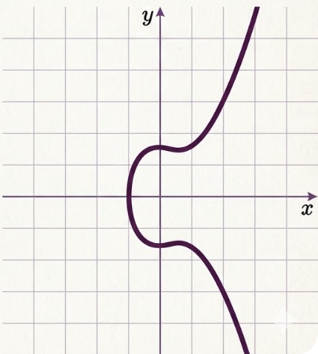
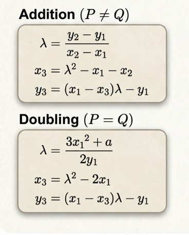

*Original presentation by Jinwoo Lee on Nov 7, 2024*

## 1. Elliptic Curve over Finite Field



$$
y^2 = x^3 + ax + b
$$

### 1.1. secp256k1 Elliptic Curve

$$
y^2 \pmod p  = x^3 + 7 \pmod p
$$

#### Finite Field (유한체)

유한체 위에 있으므로 유한체를 정의하기 위한 prime number $p$가 필요합니다.

$$
p = 2^{256}-2^{32}-2^9-2^8-2^7-2^6-2^4-1
$$

$$
0, 1, 2, ..., p - 1
$$

### 1.2. Cyclic Group (순환군)

#### 정의

- 군 $G$가 하나의 원소 $g$로부터 생성될 수 있을 때 <strong>순환군</strong>이라고 합니다.
  $$G = \langle g \rangle = \{g^n \mid n \in \mathbb{Z}\}$$
- $g$: Generator(생성원)
- 순환군이면 <strong>아벨군(가환군)</strong>입니다. (교환법칙 성립)

**Group (군)의 성질**:
1.  **닫혀있음 (Closure)**: 연산 결과가 항상 군 안에 존재.
2.  **결합 법칙 (Associativity)**: $(a+b)+c = a+(b+c)$.
3.  **항등원 (Identity)**: $a+0 = a$.
4.  **역원 (Invertibility)**: $a+(-a) = 0$.

#### Order (위수)

하나의 Base Point로 시작해서 `+` 연산을 계속하다 보면 다시 처음의 Base Point로 돌아오게 됩니다. 이때 처음으로 돌아오는 연산 횟수 $n$을 순환군의 <strong>Order(위수)</strong>라고 부릅니다.

> **왜 순환군인가?**
> 유한체에 대한 타원곡선 위의 임의의 점을 Base Point $G$로 잡고 연산을 정의하면 순환군을 이룹니다. 이때 순환군의 위수 $n$은 $p$와 다를 수 있습니다.

#### 타원곡선 연산 시 주의할 점
- **점 연산** (타원곡선 방정식): $\text{mod } p$ 사용
- **스칼라 연산** (점 앞에 붙는 계수): 위수를 사용하여 $\text{mod } n$ 사용

### 1.3. 무한원점 & 타원곡선 덧셈 연산



Base Point $G$ $\rightarrow$ 타원곡선 위의 점 $(x_g, y_g)$에 대해 Private Key $x$만큼 덧셈 연산을 하여 Public Key를 얻을 수 있습니다.

$$
P = xG
$$

- $P$: Public Key
- $x$: Secret Key
- $G$: Base Point

> Base Point에 대해 $x$만큼 덧셈을 하는 것은 쉽지만, $P, G$로부터 $x$를 알아내는 것은 수학적으로 매우 어렵다고 알려져 있습니다 (**Discrete Logarithm Problem**).

- **Uncompressed Pubkey**: $P_x$ (32bytes) + $P_y$ (32bytes) + prefix `0x04` = 65bytes
- **Compressed Pubkey**: $P_x$ (32bytes) + prefix `0x02`/`0x03` ($y$ 부호) = 33bytes
- **Secret Key**: 32bytes

---

## 2. Digital Signature using Elliptic Curves

### 2.1. Create Signature

Given Key Pair: $P$ (Public), $x$ (Secret) where $1 < x < n$.

1.  **Random Nonce $k$ 생성**:
    $$1 < k < n$$

2.  **Point $R$ 계산**:
    $$R = kG, \quad r = R_x$$

3.  **Signature $(r, s)$ 생성**:
    $$s = k^{-1}(m + rx) \pmod n$$
    ($m$: message hash, $k^{-1}$: inverse of $k$)

### 2.2. Verify Signature

$s$에 대한 수식을 변형하여 검증합니다.

$$
k = s^{-1}(m + rx)
$$

양변에 $G$를 곱하고 $R=kG, P=xG$를 대입합니다:

$$
R = s^{-1}mG + s^{-1}rP
$$

1.  좌변 $R$은 서명 $(r,s)$의 $r$로부터 얻을 수 있습니다.
2.  우변은 $m, s, r, P, G$를 대입하여 계산합니다.
3.  좌우변의 $x$좌표가 같음을 보이면 검증 완료입니다.

> **Note**: `secp256k1`은 `recovery` 메서드를 지원하여, 서명과 메시지만으로 Public Key를 복구할 수 있습니다. 이를 위해 서명에 `v` 값을 포함합니다.

---

## 3. TSS (Threshold Signature Scheme)

- **SSS (Shamir Secret Sharing)**: 비밀키를 나눠 갖고, $k$개를 모아 <strong>복구</strong>하여 사용합니다.
    - **단점**: 복구 시점에 Single Point of Failure가 발생합니다.

- **TSS**: 키를 나눠 가진 상태에서, **비밀키 복구 없이** 각자 부분 서명(Partial Signature)을 생성하고, 이를 합쳐 완성된 서명을 만듭니다.

### 3.1. Schnorr Signature

#### Create & Verify

1.  **난수 $k$ 및 $R$ 값 계산**: $R = kG$
2.  **Challenge $c$ 계산**: $c = H(R \parallel M)$
3.  **서명 $s$ 계산**: $s_{schnorr} = (k + cx) \pmod n$

**서명 결과**: $(R, s)$

#### Verification
$$
sG = (k + cx)G = R + cP
$$
좌변($sG$)과 우변($R + cP$)이 같음을 확인합니다.

#### Advantage
- **Linearity**: Multi-Signature와 Aggregation에 유리합니다.
- **Zero Knowledge Proof**: 비밀키 $x$를 노출하지 않고 소유를 증명할 수 있습니다.

### 3.2. Cryptographic Architecture of TSS

과정을 3단계로 나누어 살펴봅시다.

#### 1) Sharing Secret and Nonce

1.  **Secret Key Sharing**: MPC 참여자가 비밀키 $x$를 SSS로 나눠가집니다.
    $$
    x = \sum_i x_i \lambda_i, \quad P_i = x_iG
    $$

2.  **Nonce Sharing**: Nonce $k$는 나누는 것이 아니라, 각자 난수 $k_i$를 생성한 후 합치는 방식입니다.
    $$
    k = \sum_i k_i \lambda_i
    $$

#### 2) Create Partial Signature ($r_i, s_i$)

각 참여자는 자신의 파편으로 부분 서명을 생성합니다.

$$
R_i = k_iG
$$
$$
s_i = k_i + c x_i \pmod n
$$

#### 3) Aggregate Partial Signatures

부분 서명들을 합쳐(Interpolation) 하나의 서명을 만듭니다.

$$
s = \sum_i s_i \lambda_i = k + cx
$$

#### 4) Verify Complete Signature

$$
sG = (R + cP)
$$

외부에서는 이것이 단일 서명인지, MPC 서명인지 구분할 수 없습니다.

---

## 4. Code Example

`mpc-cmp` Schnorr ZK Proof implementation (pseudo-C code):

```cpp
#include "crypto/zero_knowledge_proof/schnorr.h"

// 슈노르 ZK Proof 생성
static zero_knowledge_proof_status schnorr_zkp_generate_impl(...)
{
    // 1. R = kG
    status = algebra->generator_mul(algebra, &proof->R, &k);

    // 2. Challenge c = H(prover_id || R || public_data)
    SHA256_Init(&sha_ctx);
    SHA256_Update(&sha_ctx, prover_id, id_len);
    SHA256_Update(&sha_ctx, proof->R, sizeof(proof->R));
    SHA256_Update(&sha_ctx, *public_data, sizeof(elliptic_curve256_point_t));
    SHA256_Final(c, &sha_ctx);

    // 3. s = k - c * x
    status = algebra->mul_scalars(algebra, &c, secret, secret_size, c, sizeof(c));
    status = algebra->sub_scalars(algebra, &proof->s, k, sizeof(k), c, sizeof(c));

    return ZKP_SUCCESS;
}
```
